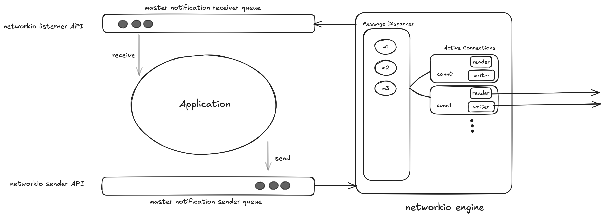

a lightweight application layer networking protocol ensuring resilient message delivery and connection handling without giving any fuss to the user



- guarantees FIFO messages delivery

- takes care of all things networking, sending stuff, receiving stuff, queueing stuff, buffering stuff, broken connections, reconnections, retransmitting messages, ensuring that the messages get delivered relibly with ACKs, serialization, and all the stuff 

- built on top of TCP

- uses GOB for serialization

- peers can recognize each other after reconnection and retransmit what was left unsaid(wish real life worked like that)

- handles thousands of active connections without any fuss

- A message is considered read when a peer acknowledges it

- The application only has to deal with two APIs for the most part, want to send a message to a peer ? it's all notifications, just add a notification telling who to tell what and you'll be notified when they receive it, similarily when you receive something from a peer you'll be notified and they'll know for certain that you have received the message

- the notifications queues are extremely lightweight, only delivering notifications, the application chooses what to do with those notifications, the notification just lets the application know them know there is data to be read in some connection, and the application can either sit on it, and go ahead and read it with a simple networkio API , it can read all the messages from that peer, or just 1 or 2 or whatever it wants, and the rest will be there to be read 

- so simple even a primate could use it


example server:
```
<go_server_code>
```

and just do this for client:
```
<go_client_code>
```
